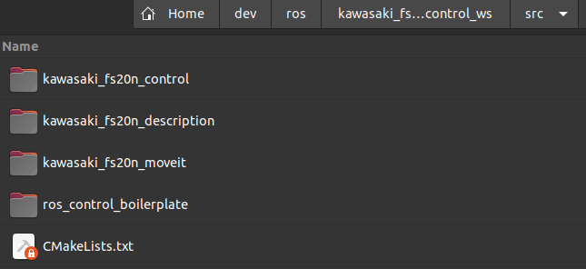

# Controlling Kawasaki FS020N robotic arm via ROS by MoveIt!

## Installation

1. Install ROS Noetic ([follow steps listed here](http://wiki.ros.org/noetic/Installation/Ubuntu)) on Ubuntu 20.04.

    `Note` Install Desktop-Full version of ROS.

    `Note` To chech version of your Ubuntu use `lsb_release -a` or `cat /etc/*-release`.

2. Install extra packages:

```
sudo apt install libgflags-dev ros-noetic-rosparam-shortcuts ros-noetic-ros-controllers
```

3. Install MoveIt!:

```
sudo apt install ros-noetic-moveit ros-noetic-moveit-resources-prbt-moveit-config
```

4. Download the packages `kawasaki_fs20n_control`, `kawasaki_fs20n_description`, `kawasaki_fs20n_moveit`, `ros_control_boilerplate` from the repository and put them into your ROS workspace's src folder (in my case it is  `kawasaki_fs20n_control_ws` workspace):

<div style="text-align: center">
    
</div>

`Note` Don't forget add `source ~/dev/ros/kawasaki_fs20n_control_ws/devel/setup.bash` into the `~/.bashrc` file (If you have different location and/or name of the workspace the path in the source command should be corresponding).

5. Go to your ROS workspace (in my case it is `~/dev/ros/kawasaki_fs20n_control_ws`) and build the workspace:

```
catkin_make
```

## Usage

### Usage with robot emulator

1. In config file `connection.yaml` in the `kawasaki_fs20n_control/config` folder set following settings:

```
robot_ip: "127.0.0.1"
robot_port: 5555
robot_version: "1040"
```

2. Run `robot_server_emulator`:

```
cd [location_of_ws]/src/kawasaki_fs20n_control
(for example: cd ~/dev/ros/kawasaki_fs20n_control_ws/src/kawasaki_fs20n_control)
./robot_server_emulator
```

`Note` If you rerun the emulator and there is an error:

```
[TEST SERVER]: bind failed: Address already in use
```

then just wait a little bit until socket is free.

3. Launch `kawasaki_fs20n_control.launch`:

```
roslaunch kawasaki_fs20n_control kawasaki_fs20n_control.launch
```

4. In RViz window you can use MoveIt! plugin to plan manipulator trajectory and execute it.


### Usage with real robot

1. In config file `connection.yaml` in the `kawasaki_fs20n_control/config` folder set following settings:

For controlling right manipulator (from the side of the door):

```
robot_ip: "192.168.5.242" # ROBOT R
robot_port: 10050
robot_version: "1040"
```

For controlling left manipulator (from the side of the door):

```
robot_ip: "192.168.5.250" # ROBOT L
robot_port: 10050
robot_version: "1040"
```

`Note` Aforementioned IPs and port are local for the BMSTU laboratory.

`Note` The robot version must correspond the version that is set in the AS program inside Kawasaki manipulator (variable `.version`, [repository with the code](https://github.com/gulalex181/kawasaki_fs020n_ros_control_AS_code))

2. Launch `kawasaki_fs20n_control.launch`:

```
roslaunch kawasaki_fs20n_control kawasaki_fs20n_control.launch
```

3. In RViz window you can use MoveIt! plugin to plan manipulator trajectory and execute it.